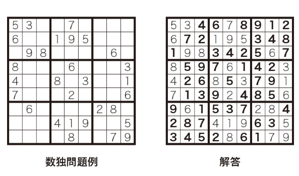
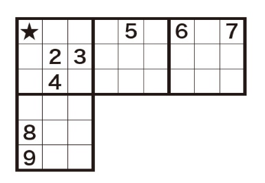
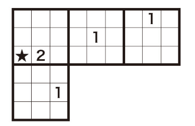
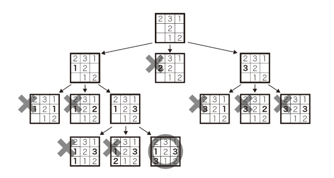

# パズルで鍛えるアルゴリズム力

## 選定理由

数独のアルゴリズム化から考える観点を向上ができると思ったため  
新人が聞きやすい内容をチョイスしようと思ったため

## 数独とは

数独？ナンプレ？

縦・横の各列および太線で囲まれた3x3のブロック内に同じ数値が入らない用にするパズル。

## 解くための手筋

### 手筋①

★の座標に対して太枠、横、縦に注目し、入る候補を絞るやり方。（ルールと同様）
太枠(2,3,4)横(5,6,7)縦(8.9)なので、★には必ず1が入ります。

図のパターンは★座標に対して確定するが、実際には候補が複数で確定しないことが多いです。

### 手筋②

★以外のマスに1が入るかチェックすると、入る余地がないので、★が1となる。

## 雑誌記事のアルゴリズム

今回は手筋1のみ利用し、探索的アルゴリズムやバックトラッキングを利用してアルゴリズムを組み立てます。

### 深さ優先探索（DFS）

探索的アルゴリズムは、深さ優先探索(Depth-First Search)を用います。今回は、座標の順に手筋１で候補を絞りながら順に数値を入れていき、候補がなくなって表が完成できなくなったら前の選択へ戻って候補を入れていきます。

※他に幅優先探索(Breadth-First Search)もある

### バックトラッキング

再帰呼び出しをする際のポイント
・使いまわせるものは使いまわす。リソースを無駄に消費しない。

悪い例

~~~cpp
public void Dfs(Sudoku board)
{
    // 完成しているかどうか
    if (マス目がすべて埋まったら)
    {
        // ここで解を確定する
        Array.Copy(board.field, res, board.field.Length);
        return;
    }

    // x,yに入る選択肢を手筋１で絞る
    var canUse = board.FindChoices(x, y);

    // 候補を実施する
    foreach(var val in canUse)
    {
        // boardをコピー
        var board2 = board.DeepCopy(); // C#だとクラスを複製するのが手間なので、なかなか悪い例に倒れにくい

        // 候補を入れてみる
        board2.Put(x, y, val);

        // 再帰呼び出しする
        Dfs(board2);
    }
}
~~~

良い例（バックトラッキング）

~~~cpp
public void Dfs(ref Sudoku board, ref int[,] res)
{
    // 完成しているかどうか
    if (マス目がすべて埋まったら)
    {
        // ここで解を確定する
        Array.Copy(board.field, res, board.field.Length);
        return;
    }

    // x,yに入る選択肢を手筋１で絞る
    var canUse = board.FindChoices(x, y);

    // 候補を実施する
    foreach(var val in canUse)
    {
        // 候補を入れてみる
        board.Put(x, y, val);

        // 再帰呼び出しする
        Dfs(board);

        // 候補を消して戻す
        board.Reset(x, y);
    }
}
~~~

### 完成したアルゴリズム
~~~cpp
public void Dfs(ref Sudoku board, ref int[,] res)
{
    // 空きマスの座標を表す
    int x = 0, y = 0;

    // 空白を確認　なければ解としてリターン　★１
    if (!board.FindEmpty(ref x, ref y))
    {
        // 解に追加
        Array.Copy(board.field, res, board.field.Length);
        return;
    }

    // 選択肢を確認　★２
    var canUse = board.FindChoices(x, y);

    // バックトラッキング　★３
    foreach(var val in canUse)
    {
        board.Put(x, y, val);
        Dfs(ref board, ref res);
        board.Reset(x, y);
    }
}

public List<int> FindChoices(int x, int y)
{
    List<int> canUse = new List<int> { 1, 2, 3, 4, 5, 6, 7, 8, 9 };

    // 行を見て選択肢を絞る
    for (int i = 0; i < 9; ++i) 
    {
        if (field[x, i] != -1) 
        {
            canUse.Remove(field[x, i]); 
        }
    }

    // 列を見て選択肢を絞る
    for (int i = 0; i < 9; ++i)
    {
        if (field[i, y] != -1)
        {
            canUse.Remove(field[i, y]);
        }
    }

    // 3*3 ブロックの中で選択肢を絞る
    // cx,cyは中央マスとなるよう計算
    int cx = x / 3 * 3 + 1, cy = y / 3 * 3 + 1;
    for (int i = cx - 1; i <= cx + 1; ++i)
    {
        for (int j = cy - 1; j <= cy + 1; ++j)
        {
            if(field[i, j] != -1)
            {
                canUse.Remove(field[i, j]);
            }
        }
    }

    return canUse;
}
~~~

★１で空白の座標を見つける。  
★２で空白の候補を手筋１より見つける。  
★３で候補をループで実施。また、候補の先を再帰呼び出しで実施。

デモ

53**7****
6**195***
*98****6*
8***6***3
4**8*3**1
7***2***6
*6****28*
***419**5
****8**79
